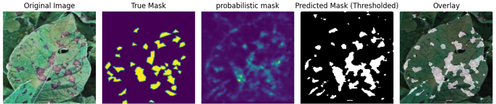

# Farm Monitoring System

## Overview

The Farm Monitoring System is a sophisticated computer vision project designed to revolutionize on-farm surveillance and management. The primary goal is to empower farmers with actionable insights derived from real-time video surveillance and advanced deep learning models. The project addresses key aspects of tomato farming, including disease detection, impact assessment, and overall crop management.

## Purpose

Modernizing Agriculture: Agriculture is the backbone of our society, and this project aims to bring cutting-edge technology to the fields. By leveraging computer vision and deep learning, we strive to modernize agricultural practices and enhance the efficiency and sustainability of tomato farming.

### Key Objectives

1. **Early Disease Detection:**
   - Detect diseases in tomatoes at an early stage using the CCT Deep Learning Model.
   - Enable timely intervention, reducing crop losses and ensuring healthier yields.

2. **Impact Assessment:**
   - Utilize SegNet to assess the proportion of disease impact on tomato plants.
   - Provide farmers with quantitative data to make informed decisions about crop management.

3. **Resource Optimization:**
   - Optimize pesticide usage based on real-time disease severity data.
   - Contribute to sustainable farming practices by minimizing the environmental impact of pesticide use.

4. **Tomato Tracking and Maturity Analysis:**
   - Employ YOLOv8 for detecting, tracking, and counting tomatoes based on their maturity level.
   - Offer insights into the quantity and maturity of tomatoes, aiding in harvest planning and market readiness.

## How It Works

- The system continuously monitors the farm through CCTV cameras, capturing real-time video footage.
- The CCT Deep Learning Model analyzes the footage, flagging potential disease instances early in their development.
- The SegNet model calculates the proportion of disease impact, helping farmers prioritize areas for intervention.
- Pesticide usage is optimized based on the severity of the detected diseases.
- YOLOv8 tracks and counts tomatoes, providing valuable data for harvest planning.

